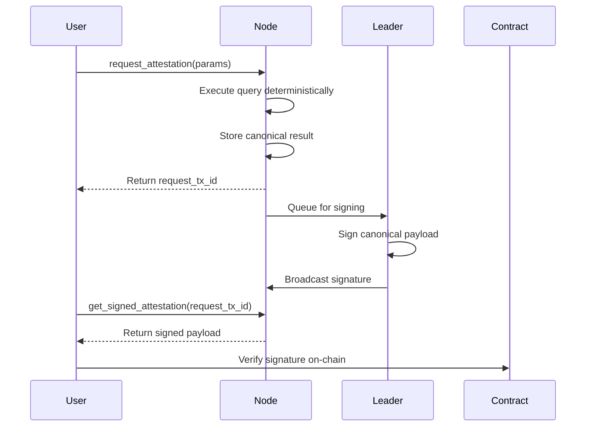

# Attestations

## What Are Attestations?

Attestations are cryptographically signed proofs of query results from TrufNetwork nodes. Instead of trusting raw API responses, downstream applications can verify that a TrufNetwork validator executed a specific query and attested to the results.

**Use Cases:**
- Oracle integrations that require verifiable data feeds
- On-chain settlements based on off-chain query results
- Trustless data bridges between TrufNetwork and other blockchains

## How It Works

**Workflow:**
1. Submit `request_attestation` with query parameters
2. Node executes the query deterministically and stores the result
3. Leader validator signs the canonical payload asynchronously
4. Retrieve the signed payload via `get_signed_attestation`
5. Verify the signature on-chain using the EVM consumer library

## Requesting Attestations

Call the `request_attestation` action with the following parameters:

- **data_provider**: The data provider's address (0x-prefixed)
- **stream_id**: The stream identifier (32 characters)
- **action_name**: The query action to attest (e.g., `get_record`, `get_index`, `get_change_over_time`, `get_last_record`, `get_first_record`)
- **args_bytes**: ABI-encoded arguments for the query action
- **encrypt_sig**: Must be `false` (encryption not yet supported)
- **max_fee**: Maximum fee you're willing to pay for the attestation

All standard query actions are supported for attestation. The node executes the query deterministically to ensure all validators compute identical results.

**Returns:** `request_tx_id` (use this to retrieve the signed attestation) and `attestation_hash`

## Retrieving Attestations

Call the `get_signed_attestation` action with the `request_tx_id` from your attestation request.

**Returns:** A single payload containing:
- Canonical bytes (8 fields: version, algorithm, block height, data provider, stream ID, action ID, arguments, result)
- 65-byte secp256k1 signature

**Note:** Signing is asynchronous. If the signature isn't ready yet, retry after a short delay (typically completes within seconds).

## SDK Integration

For integration examples and higher-level abstractions, refer to the attestation sections in each SDK's documentation:
- [Go SDK](https://github.com/trufnetwork/sdk-go)
- [TypeScript SDK](https://github.com/trufnetwork/sdk-js)
- [Python SDK](https://github.com/trufnetwork/sdk-py)

## Verifying On-Chain

To verify attestation signatures in your Solidity contracts, use the TrufAttestation library:

**Repository:** [`github.com/trufnetwork/evm-contracts`](https://github.com/trufnetwork/evm-contracts)

**Documentation:** Start with [`docs/AttestationLibrary.md`](https://github.com/trufnetwork/evm-contracts/blob/main/docs/AttestationLibrary.md) for:
- Parsing canonical payloads
- Signature verification
- Decoding data points
- Best practices (validator allowlists, replay protection, freshness checks)

## Technical Details

**Canonical Encoding:** The attestation payload contains 8 fields in a length-prefixed format. The encoding is maintained in [`extensions/tn_attestation/canonical.go`](../extensions/tn_attestation/canonical.go). Any changes to this format must stay in sync with consumer libraries.

**Signature Algorithm:** secp256k1 (same as Ethereum)

**Deterministic Execution:** All query actions are executed with `use_cache=false` to ensure validators compute identical results regardless of cache state.

## Current Limitations

- **Single Validator Signature:** Phase 1 provides a single signature from the current leader. Multi-signature support is planned for future phases.
- **No Signature Encryption:** The `encrypt_sig` parameter must be `false`. Encrypted signatures are not yet implemented.
- **Trust Model:** Consumers must implement their own validator trust model (allowlists, rotation policies, etc.). The attestation contains only the signature; verification is the consumer's responsibility.
